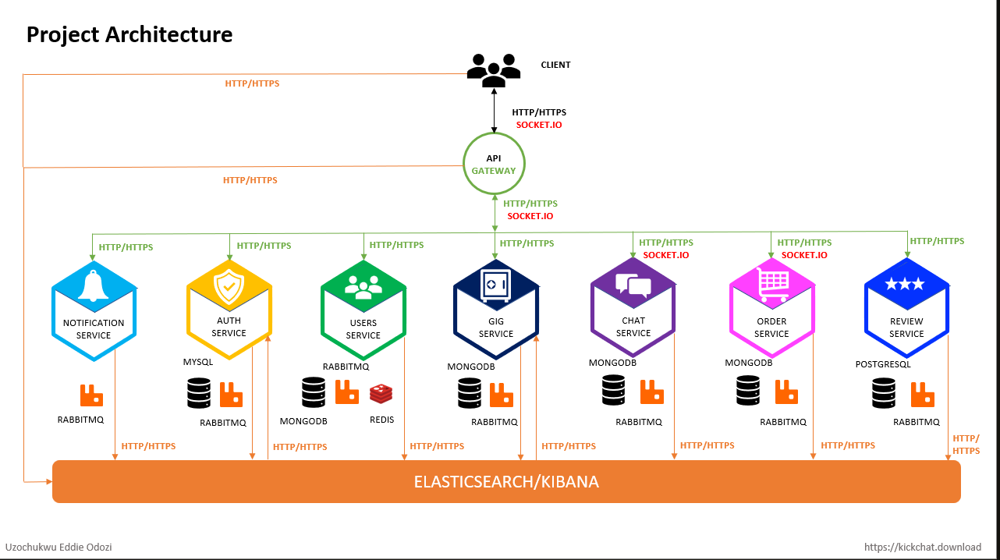

# This is repo for Job-Board Application

## Project Description

- Job-Board is a freelance market place where sellers can sell gigs and buyer can either purchase a gig or demand a custom gig
- Sub domains
    - Notification service -> handles mails
    - Auth -> authorization 
    - User -> both sellers and buyers
    - Gig service -> CRUD gig, connect to ES
    - Chat service -> handles messages
    - Orders -> purchase and payment
    - Review service

## Functional Requirement
- User auth - create acc, change pass 
- User profile (seller)
- Search and Filter gigs
- Messaging system -> communication b/w buyer and seller
- Reviews
- Payment
- View orders - active, success and failed orders
- cancel orders

## Non Function Requirements
- Scalability - to accommodate peak loads
- Availability - 99.99% available
- Reliable
- Maintainable
- Usability

## Design Decisions
- No direct communication b/w client and service -> all request go through api gateway
- Https/socket io based communication b/w service and api-gateway
- Inter services communication will be event driven [ async ] (no HTTP)
- token generation will be handled by api gateway
- all services except api gateway is not accessible from outside
- every request from api gateway will include a token
- micro-services will send client errors to Api gateway and rest rest will be sent to monitoring and logging system

## Architecture

## Inter process Communication
Async communication via RabbitMQ ( event driven )

